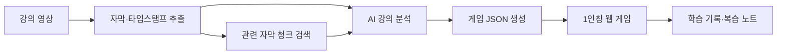

# 강의실 탈출

> **강의 영상을 나만의 1인칭 방탈출 게임으로 바꾸는 AI 학습 플랫폼**

강의를 듣고 퀴즈를 푸는 데서 끝나지 않습니다. 사용자가 강의 영상을 올리면 AI가 핵심 개념, 사례, 타임스탬프를 분석하고, 이를 바탕으로 **강의 전용 스토리·인테리어·오브젝트·퍼즐·힌트·해설**을 생성합니다. 학습자는 초현실적인 1인칭 방 하나를 탐색하며 강의 내용을 직접 적용해 탈출합니다.

## Demo flow

```text
강의 영상 업로드
  → 자막 및 타임스탬프 추출
  → 핵심 개념·사례 분석
  → 강의 맞춤형 방 한 개와 퍼즐 자동 생성
  → 1인칭 방탈출 플레이
  → 오답·힌트 기록 기반 복습
```

## 왜 강의실 탈출인가요?

일반적인 학습 앱이 짧은 문제를 반복 풀이하는 데 집중한다면, 강의실 탈출은 **강의 내용이 게임 세계를 구성하는 재료**가 됩니다.

| 일반 학습 퀴즈 | 강의실 탈출 |
| --- | --- |
| 문제를 순서대로 푼다 | 공간을 탐색하며 단서를 발견한다 |
| 모든 학습자가 유사한 문제를 푼다 | 업로드한 강의마다 방과 퍼즐이 달라진다 |
| 정답/오답만 제공한다 | 정답 근거와 영상 타임스탬프를 제공한다 |
| 반복 학습 중심 | 스토리, 공간 변화, 탈출 목표를 통한 몰입 학습 |

## Key features

### 1. 강의 맞춤형 게임 생성

- 영상의 자막을 타임스탬프와 함께 추출합니다.
- AI가 핵심 개념, 사례, 오개념을 정리합니다.
- 분석 결과를 기반으로 방 하나의 스토리, 인테리어, 오브젝트, 퍼즐을 생성합니다.

### 2. 1인칭 방탈출 학습

- 방 안의 물건을 조사해 문제와 연결된 단서를 찾습니다.
- 정답을 맞히면 문, 조명, 오브젝트가 변화하며 탈출 경로가 드러납니다.
- 영상의 주제와 사례가 스토리, 인테리어, 색감, 오브젝트, 문제 접근 방식까지 결정합니다.

### 3. 학습을 돕는 힌트와 해설

- 단계형 힌트는 정확히 2회 제공합니다: 1차 관찰 → 2차 개념
- 두 번째 힌트 이후에는 힌트 버튼이 `정답 공개`로 바뀝니다.
- 정답 공개 팝업에서 정답, 해설, 영상 근거, 재시청 시점을 함께 제공합니다.
- 힌트·정답 보기 횟수와 오답 개념을 학습 노트에 누적

### 4. 하나의 방에서 완성하는 학습 흐름

1. **탐색**: 강의의 핵심 개념과 연결된 물건을 조사합니다.
2. **해석**: 사례와 단서를 조합해 퍼즐을 풉니다.
3. **탈출**: 최종 잠금을 해제하고 핵심 내용을 복습합니다.

## Architecture



### Game data contract

프론트엔드와 생성 API는 공통 게임 데이터(JSON)를 주고받습니다. 각 문제는 반드시 정답, 힌트, 해설, 그리고 영상 근거 타임스탬프를 가집니다. 실행 가능한 전체 예시는 실제 26분 41초 자막을 사용한 [`coding-agents.room.json`](content/sample-lectures/coding-agents.room.json)과 아이템 배치 회귀용 [`puppy-poop.room.json`](content/sample-lectures/puppy-poop.room.json)입니다.

```json
{
  "video": {
    "segments": [{ "id": "segment-1", "startSec": 0, "endSec": 360, "text": "강의 자막" }]
  },
  "room": { "declaredPuzzleCount": 5, "views": [{ "id": "desk", "kind": "CLOSEUP", "label": "책상" }] },
  "items": [{
    "id": "concept-book",
    "label": "개념 책",
    "assetKey": "book",
    "description": "강의의 핵심 개념이 적힌 책",
    "source": { "type": "SCENE", "viewId": "desk" }
  }],
  "puzzles": [{
    "kind": "ITEM_PLACEMENT",
    "candidateItemIds": ["concept-book", "distractor-book"],
    "slots": [{ "id": "bookshelf-slot-1" }],
    "solution": [{ "slotId": "bookshelf-slot-1", "itemId": "concept-book" }],
    "feedback": {
      "defaultWrongItem": "이 슬롯에 사용할 아이템을 다시 살펴보세요.",
      "wrongSlot": "아이템과 슬롯의 개념 관계를 확인하세요.",
      "byItemId": { "distractor-book": "개념 차이를 설명하는 오답 피드백" }
    },
    "hints": [
      { "level": 1, "type": "OBSERVATION", "text": "관찰 힌트" },
      { "level": 2, "type": "CONCEPT", "text": "개념 힌트" },
      { "level": 3, "type": "DIRECTION", "text": "풀이 방향" }
    ],
    "explanation": { "title": "정답", "body": "정답 해설", "evidenceSegmentIds": ["segment-1"] }
  }],
  "completion": { "finalPuzzleId": "puzzle-5", "exitItemId": "exit-key", "effect": "UNLOCK_EXIT" }
}
```

생성 JSON은 스키마 호환을 위해 `OBSERVATION`, `CONCEPT`, `DIRECTION` 레코드를 보존하지만, 플레이 화면은 앞의 두 레코드만 힌트 1/2·2/2로 노출합니다. 이후에는 세 번째 힌트를 따로 보여주지 않고 `explanation`을 사용해 정답과 근거를 공개합니다.

현재 실행기는 문제 의미에 따라 다음 9개 템플릿을 조합합니다. 자유 텍스트 입력 대신 방 안의 물건과 장치를 직접 조작합니다.

| 템플릿 | 상호작용 | 사용 예시 |
| --- | --- | --- |
| `MISSING_TOKEN` | 아이템 배치 | 책장의 빈 개념 완성 |
| `ORDER_ITEMS` | 아이템 배치 | 사건·과정 순서 배열 |
| `KEY_TO_LOCK` | 아이템 배치 | 사례에 맞는 열쇠 선택 |
| `MATCH_ITEM` | 아이템 배치 | 개념과 사례 연결 |
| `NUMERIC_KEYPAD` | 숫자키패드 | 수식 계산 결과 입력 |
| `SYMBOL_KEYPAD` | 문자·기호키패드 | 공식·지표 약어 조합 |
| `MULTI_DIAL` | 다중 다이얼 | 여러 구성요소 순서 맞추기 |
| `SWITCH_BANK` | 선택 스위치 | 맞는 특징 여러 개 켜기 |
| `FINAL_SAFE` | 아이템 배치 | 직전 장치에서 얻은 손잡이·기어·전원 코어로 최종 금고 조립 |

## Repository structure

```text
lecture-escape/
├── apps/
│   ├── web/                    # 1인칭 게임 클라이언트
│   └── api/                    # 영상 분석·게임 생성 API
├── packages/
│   ├── game-engine/            # 퍼즐, 방 해금, 힌트·정답 사용 로직
│   ├── content-schema/         # 프론트·백엔드 공통 JSON 규격
│   └── video-analyzer/         # 자막, 개념, 타임스탬프 분석
├── content/
│   ├── templates/              # 방·테마·퍼즐 생성 템플릿
│   └── sample-lectures/        # 데모용 게임 데이터
├── docs/                       # 아키텍처와 협업 문서
├── tests/                      # 통합·E2E 테스트
└── infra/                      # 배포 환경 설정
```

## Team roles

| 팀 | 역할 | 담당 |
| --- | --- | --- |
| 1팀 | 메인 빌더 | `apps/web`, `packages/game-engine` — 1인칭 공간, 상호작용, 퍼즐 UI |
| 1팀 | 보조 | `content/templates`, `content/sample-lectures` — 스토리, 방 디자인, 문제·힌트 |
| 2팀 | 메인 빌더 | `apps/api`, `packages/video-analyzer` — 영상/자막 분석, 게임 JSON 생성 |
| 2팀 | 보조 | `packages/content-schema`, `tests`, `infra` — 데이터 규격, 품질, 통합 |

## Getting started

현재 브랜치의 오브젝트 퍼즐 프로토타입은 외부 패키지 설치 없이 Node.js 20 이상에서 실행할 수 있습니다.

```bash
git clone https://github.com/Codex-Hackathon-06/Codex-Hackathon-06.git
cd Codex-Hackathon-06
npm start
```

브라우저에서 `http://127.0.0.1:4173`을 열면 실제 코딩 에이전트 자막 기반 데모가 기본으로 열립니다. 상단 선택기에서 기존 문학 데모로 전환할 수도 있습니다.

```text
방 전체 보기
→ 책장·벽면·서랍·책상 확대
→ 스위치 선택
→ 보상 액세스 카드를 벽 패널에 드롭해 소모·해금
→ 수식 답을 숫자키패드로 입력
→ 보상 황동 열쇠를 잠긴 서랍에 드롭해 소모·해금
→ Terminal-bench 구성요소를 다이얼로 정렬
→ 보상 전원 퓨즈를 책상에 드롭해 소모·해금
→ REXBench 지표를 문자키패드로 해독
→ 금고 손잡이·잠금 기어·전원 코어를 수집해 최종 금고 슬롯에 배치·소모
→ 오답 피드백·힌트 1/2·힌트 2/2·정답과 영상 근거 공개
→ 비상구 키카드를 문에 드롭해 소모한 뒤 열린 문을 눌러 탈출
```

다음 장소는 앞 퍼즐을 맞혔다는 이유만으로 자동 개방되지 않습니다. 보상 물건을 직접 회수해 잠긴 가구에 사용해야 하며, 순서를 건너뛰어 누르면 각 장치에 정의된 잠김 문구만 표시됩니다.

샘플 데이터와 구조 검사는 다음 명령으로 확인합니다.

```bash
npm run validate:sample
npm test
```

### Prototype files

```text
apps/web/                                      # 확대 탐색·인벤토리 플레이 화면
apps/web/asset-catalog.js                      # Kenney 방·오브젝트·아이템 에셋 매핑
apps/web/assets/2d/manifest.json                # 업로드할 2D 에셋 매핑
apps/web/assets/3d/manifest.json                # 업로드할 3D 모델·poster 매핑
apps/web/assets/README.md                       # 2D/3D 폴더·키·경로 계약
packages/game-engine/src/runtime.js            # 아이템·키패드·다이얼·스위치 상태 로직
packages/content-schema/                       # 생성 JSON 검증·프롬프트 빌더
content/sample-lectures/coding-agents.input.json # 실제 Whisper 산출물 기반 입력·provenance
content/sample-lectures/coding-agents.room.json  # 혼합 템플릿 5퍼즐 실행 데이터
content/sample-lectures/puppy-poop.input.json  # 30분 영상 분석 입력 예시
content/sample-lectures/puppy-poop.room.json   # 퍼즐 5개 실행 데이터
content/templates/puzzle-generation-prompt.md  # AI 생성 규칙
docs/puzzle-generator-handoff.md               # 팀 연동 계약
docs/THIRD_PARTY_ASSETS.md                     # 사용 중인 공개 에셋 출처·버전·해시·라이선스
```

코딩 에이전트 샘플은 제공된 `manifest.json`, `transcript.chunks.json`, `transcript.raw.json`, `transcript.srt`에서 필요한 자막 구간만 추려 사용합니다. 입력 fixture에는 원본 SHA-256, Whisper 모델, 언어, 생성 시각을 남기고 원본 영상이나 전체 자막 파일은 저장소에 복사하지 않습니다.

### Environment variables

```bash
cp .env.example .env
```

`.env`에는 자막 인식 또는 AI 생성에 필요한 개인 API 키만 넣습니다. 실제 키와 원본 강의 영상은 GitHub에 커밋하지 않습니다.

### Open-source design options

현재 프로토타입은 의존성 없는 HTML/CSS/JavaScript 실행 구조를 유지하면서, 공개 CC0 에셋인 [Kenney Furniture Kit](https://kenney.nl/assets/furniture-kit), [Kenney UI Pack](https://kenney.nl/assets/ui-pack), [Kenney Game Icons](https://kenney.nl/assets/game-icons)의 원본 PNG를 실제 방·출구·가구·아이템·조작 UI에 사용합니다. 발표 환경에서 오프라인으로도 동작하도록 공식 배포 ZIP에서 필요한 파일만 선별해 저장소에 포함했고 원본 라이선스 파일을 함께 보존했습니다. 정확한 출처, 버전, ZIP 해시는 [`docs/THIRD_PARTY_ASSETS.md`](docs/THIRD_PARTY_ASSETS.md), 향후 상호작용 라이브러리 선택 기준은 [`docs/open-source-design-options.md`](docs/open-source-design-options.md)에 정리했습니다.

추가 에셋은 `apps/web/assets/2d`와 `apps/web/assets/3d`에 나눠 올립니다. 두 manifest가 같은 `objects`, `items`, `exit` 키를 사용하므로 상단의 에셋 모드 선택기만 바꿔 동일한 진행 상태에서 두 방향을 비교할 수 있습니다. 2D는 `image`, 3D는 GLB `model`과 권장 `poster` descriptor를 사용하며, 누락되거나 잘못된 항목은 현재 Kenney 이미지로 폴백합니다. 실제 3D 뷰어 모듈과 모델별 카메라 조정은 GLB 파일 업로드 후 최종 시각 검수 단계에서 연결합니다.

## Git 컨벤션

<br>

### 브랜치 전략

- `main`
  - 항상 실행 가능한 안정 버전 유지
  - 직접 Push 금지
- 개인 브랜치
  - 기능 개발 및 실험 진행
  - 작업 완료 후 Pull Request를 통해 병합

<br>

### 커밋 컨벤션

| 타입 | 설명 |
|---|---|
| `feat` | 새로운 기능 추가 |
| `fix` | 버그 수정 |
| `refactor` | 코드 구조 개선 (동작 변경 없음) |
| `docs` | README 및 문서 수정 |
| `test` | 테스트 코드 추가 및 수정 |
| `style` | 코드 포맷팅 (로직 변경 없음) |
| `chore` | 환경설정, 의존성 등 기타 작업 |

<br>

## Roadmap

- [ ] 영상 파일 업로드 및 자막 추출
- [ ] 타임스탬프 기반 강의 맵 생성
- [ ] 강의 맞춤형 방·인테리어·퍼즐 게임 JSON 생성
- [x] 1인칭 오브젝트 탐색 및 퍼즐 UI
- [x] 힌트·정답 보기 팝업
- [ ] 학습 노트와 재시청 시점 제공
- [x] 하나의 방 전체 클리어 데모

## License

This project is for educational and demo purposes.
