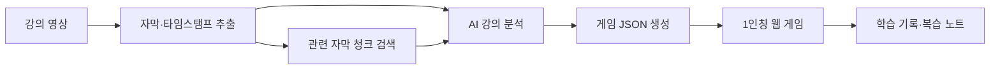

# 강의실 탈출

> **강의 영상을 나만의 1인칭 방탈출 게임으로 바꾸는 AI 학습 플랫폼**

강의를 듣고 퀴즈를 푸는 데서 끝나지 않습니다. 사용자가 강의 영상을 올리면 AI가 핵심 개념, 사례, 타임스탬프를 분석하고, 이를 바탕으로 **강의 전용 스토리·인테리어·오브젝트·퍼즐·힌트·해설**을 생성합니다. 학습자는 초현실적인 1인칭 방 하나를 탐색하며 강의 내용을 직접 적용해 탈출합니다.

## Demo flow

```text
강의 영상 업로드
  → 자막 및 타임스탬프 추출
  → 핵심 개념·사례 분석
  → 강의 맞춤형 방 한 개와 퍼즐 자동 생성
  → 1인칭 방탈출 플레이
  → 오답·힌트 기록 기반 복습
```

## 왜 강의실 탈출인가요?

일반적인 학습 앱이 짧은 문제를 반복 풀이하는 데 집중한다면, 강의실 탈출은 **강의 내용이 게임 세계를 구성하는 재료**가 됩니다.

| 일반 학습 퀴즈 | 강의실 탈출 |
| --- | --- |
| 문제를 순서대로 푼다 | 공간을 탐색하며 단서를 발견한다 |
| 모든 학습자가 유사한 문제를 푼다 | 업로드한 강의마다 방과 퍼즐이 달라진다 |
| 정답/오답만 제공한다 | 정답 근거와 영상 타임스탬프를 제공한다 |
| 반복 학습 중심 | 스토리, 공간 변화, 탈출 목표를 통한 몰입 학습 |

## Key features

### 1. 강의 맞춤형 게임 생성

- 영상의 자막을 타임스탬프와 함께 추출합니다.
- AI가 핵심 개념, 사례, 오개념을 정리합니다.
- 분석 결과를 기반으로 방 하나의 스토리, 인테리어, 오브젝트, 퍼즐을 생성합니다.

### 2. 1인칭 방탈출 학습

- 방 안의 물건을 조사해 문제와 연결된 단서를 찾습니다.
- 정답을 맞히면 문, 조명, 오브젝트가 변화하며 탈출 경로가 드러납니다.
- 영상의 주제와 사례가 스토리, 인테리어, 색감, 오브젝트, 문제 접근 방식까지 결정합니다.

### 3. 학습을 돕는 힌트와 해설

- 단계형 힌트: 관찰 → 개념 → 풀이 방향
- 정답 보기 팝업: 정답, 해설, 영상 근거, 재시청 시점 제공
- 힌트·정답 보기 횟수와 오답 개념을 학습 노트에 누적

### 4. 하나의 방에서 완성하는 학습 흐름

1. **탐색**: 강의의 핵심 개념과 연결된 물건을 조사합니다.
2. **해석**: 사례와 단서를 조합해 퍼즐을 풉니다.
3. **탈출**: 최종 잠금을 해제하고 핵심 내용을 복습합니다.

## Architecture



### Game data contract

프론트엔드와 생성 API는 공통 게임 데이터(JSON)를 주고받습니다. 각 문제는 반드시 정답, 힌트, 해설, 그리고 영상 근거 타임스탬프를 가집니다.

```json
{
  "room": "lecture-room",
  "theme": "왜곡된 거울방",
  "learningGoal": "핵심 개념을 구별한다",
  "puzzle": {
    "question": "강의의 핵심 개념은 무엇인가요?",
    "answer": "정답",
    "hints": ["관찰 힌트", "개념 힌트"],
    "explanation": "정답 해설",
    "evidence": { "start": 1240.5, "end": 1302.2 }
  }
}
```

## Repository structure

```text
lecture-escape/
├── apps/
│   ├── web/                    # 1인칭 게임 클라이언트
│   └── api/                    # 영상 분석·게임 생성 API
├── packages/
│   ├── game-engine/            # 퍼즐, 방 해금, 힌트·정답 사용 로직
│   ├── content-schema/         # 프론트·백엔드 공통 JSON 규격
│   └── video-analyzer/         # 자막, 개념, 타임스탬프 분석
├── content/
│   ├── templates/              # 방·테마·퍼즐 생성 템플릿
│   └── sample-lectures/        # 데모용 게임 데이터
├── docs/                       # 아키텍처와 협업 문서
├── tests/                      # 통합·E2E 테스트
└── infra/                      # 배포 환경 설정
```

## Team roles

| 팀 | 역할 | 담당 |
| --- | --- | --- |
| 1팀 | 메인 빌더 | `apps/web`, `packages/game-engine` — 1인칭 공간, 상호작용, 퍼즐 UI |
| 1팀 | 보조 | `content/templates`, `content/sample-lectures` — 스토리, 방 디자인, 문제·힌트 |
| 2팀 | 메인 빌더 | `apps/api`, `packages/video-analyzer` — 영상/자막 분석, 게임 JSON 생성 |
| 2팀 | 보조 | `packages/content-schema`, `tests`, `infra` — 데이터 규격, 품질, 통합 |

## Getting started

> 현재는 프로젝트 구조와 데모 게임 데이터를 제공합니다. 구현 기술 스택이 확정되면 이 절에 설치·실행 명령을 추가합니다.

```bash
git clone https://github.com/<YOUR-ORG>/lecture-room-escape.git
cd lecture-room-escape
```

### Environment variables

```bash
cp .env.example .env
```

`.env`에는 자막 인식 또는 AI 생성에 필요한 개인 API 키만 넣습니다. 실제 키와 원본 강의 영상은 GitHub에 커밋하지 않습니다.

## Git 컨벤션

<br>

### 브랜치 전략

- `main`
  - 항상 실행 가능한 안정 버전 유지
  - 직접 Push 금지
- 개인 브랜치
  - 기능 개발 및 실험 진행
  - 작업 완료 후 Pull Request를 통해 병합

<br>

### 커밋 컨벤션

| 타입 | 설명 |
|---|---|
| `feat` | 새로운 기능 추가 |
| `fix` | 버그 수정 |
| `refactor` | 코드 구조 개선 (동작 변경 없음) |
| `docs` | README 및 문서 수정 |
| `test` | 테스트 코드 추가 및 수정 |
| `style` | 코드 포맷팅 (로직 변경 없음) |
| `chore` | 환경설정, 의존성 등 기타 작업 |

<br>

## Roadmap

- [ ] 영상 파일 업로드 및 자막 추출
- [ ] 타임스탬프 기반 강의 맵 생성
- [ ] 강의 맞춤형 방·인테리어·퍼즐 게임 JSON 생성
- [ ] 1인칭 오브젝트 탐색 및 퍼즐 UI
- [ ] 힌트·정답 보기 팝업
- [ ] 학습 노트와 재시청 시점 제공
- [ ] 하나의 방 전체 클리어 데모

## License

This project is for educational and demo purposes.
